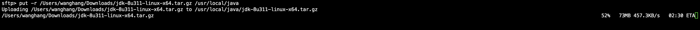
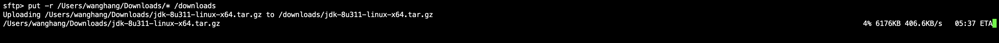
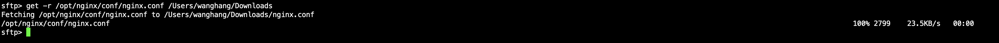
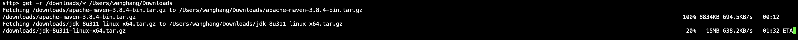

# Linux安全文件传输（sftp）

## 远程连接
> sftp user@host
- 1、打开终端，连接远程Linux：
```shell
sftp root@192.45.186.153
```
## 上传
> put local_path remote_path
- 2、上传文件：
```shell
put -r /Users/wanghang/Downloads/jdk-8u311-linux-x64.tar.gz /usr/local/java
```

- 3、上传文件夹里所有内容：
```shell
put -r /Users/wanghang/Downloads/* /downloads
```

## 下载
> get remote_path local_path
- 4、下载文件：
```shell
get -r /opt/nginx/conf/nginx.conf /Users/wanghang/Downloads
```

- 5、下载文件夹里所有内容：
```shell
get -r /downloads/* /Users/wanghang/Downloads
```

## 退出
- 6、退出：
```shell
exit
```